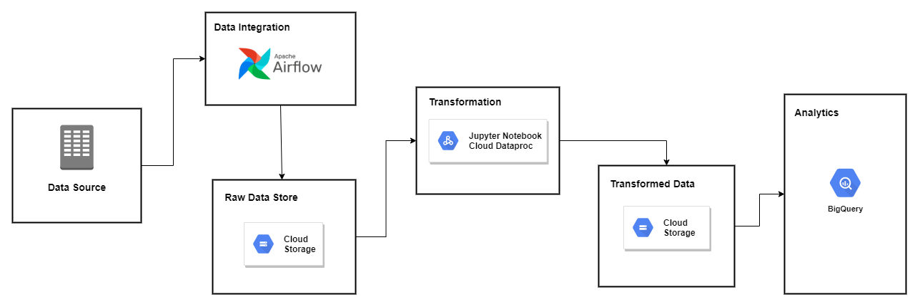
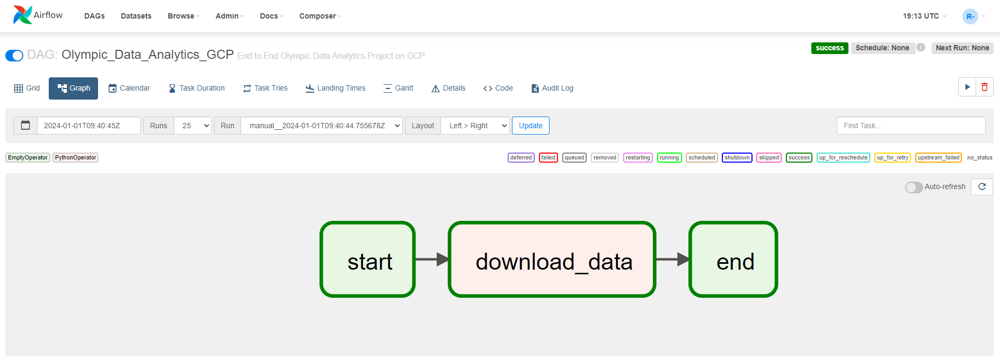
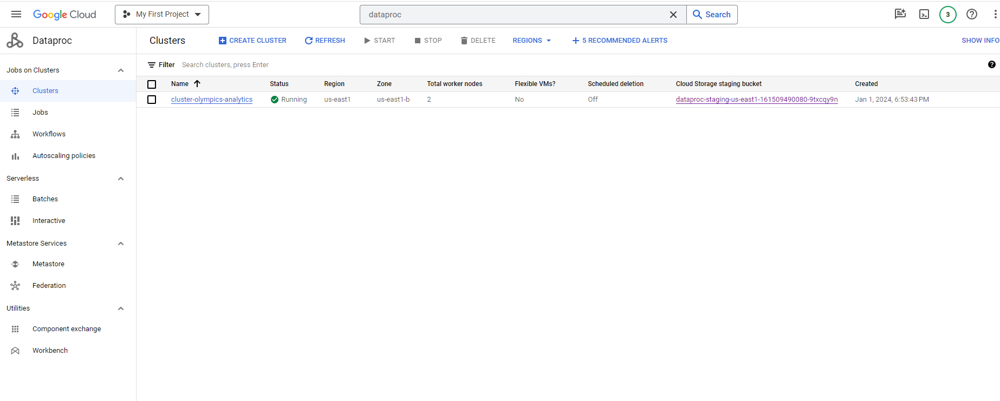
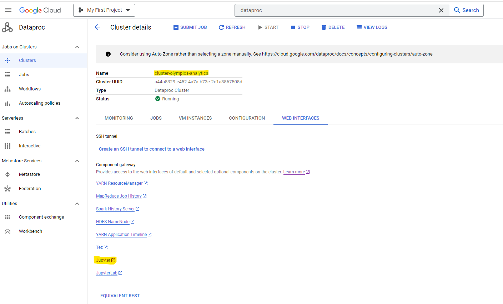
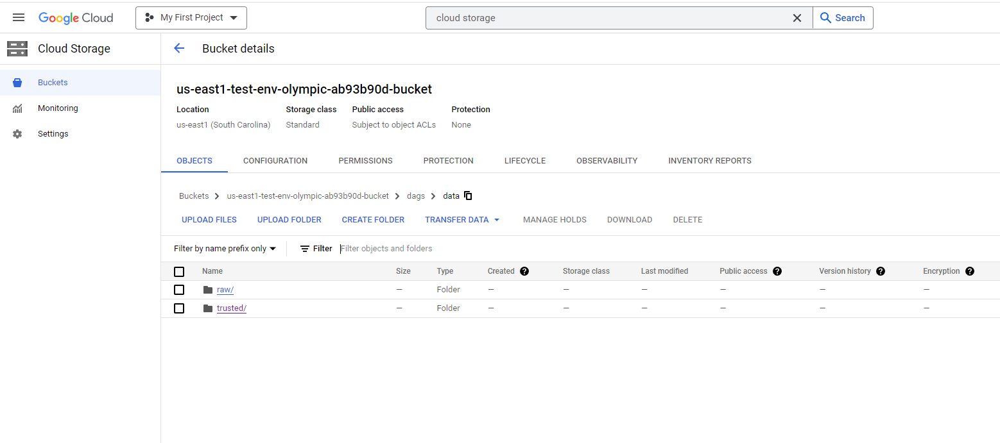
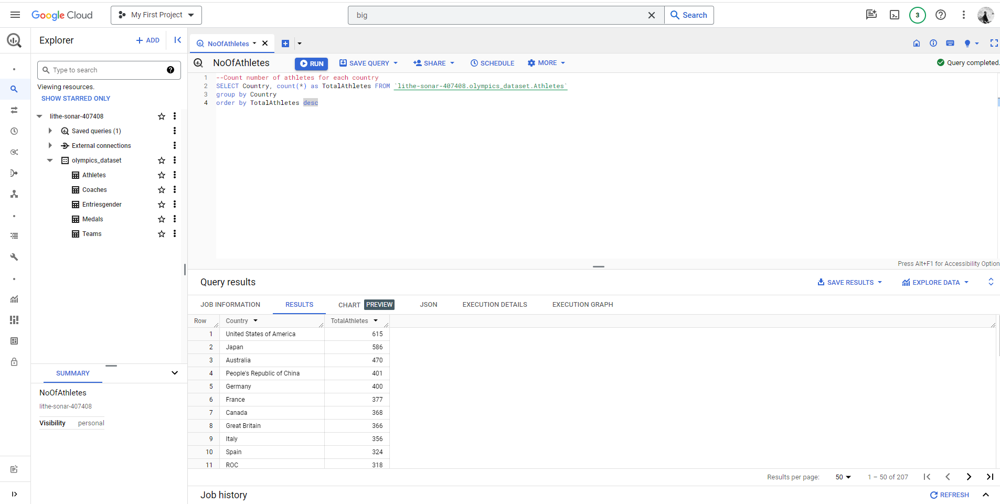

# Olympic-Data-Analytics-GCP
**Description: -**  
The Tokyo Olympic Data Analysis on GCP project is a comprehensive solution for analyzing and visualizing Olympic Games data using various GCP services. This project aims to showcase how to leverage the power of cloud computing and GCP data services to gain insights from historical Olympic data.  

**Dataset Details: -**  
This dataset contains the details of the Athletes, Coaches, Teams participating as well as the Entries by gender. There are over 11,000 athletes, with 47 disciplines, along with 743 Teams taking part in the 2021(2020) Tokyo Olympics. It contains their names, countries represented, discipline, gender of competitors, name of the coaches.  
[Dataset][!https://www.kaggle.com/datasets/arjunprasadsarkhel/2021-olympics-in-tokyo]

## Table of Contents
- [Introduction](#introduction)
- [Architecture](#architecture)
- [Technologies Used](#technologies-used)
- [Getting Started](#getting-started)
  - [Prerequisites](#prerequisites)
- [Data Ingestion](#data-ingestion)
- [Data Processing](#data-processing)
- [Data Store](#data-store)
- [Analytics](#analytics)
- [Conclusion](#conclusion)

## Introduction

The Olympic Data Analysis on GCP project demonstrates how to build an end-to-end data analysis pipeline on the GCP cloud platform. This involves ingesting raw Olympic data, transforming it into a suitable format, performing analysis, and creating insightful visualizations. The project provides an example of how to integrate and utilize Google Composer, DataProc, Big Query and other GCP services to achieve these goals.

## Architecture

The architecture of the project consists of the following components:

- **Dataproc**: It provides a collaborative and interactive environment for running Spark-based jobs.

- **Airflow**: Platform to programmatically author, schedule, and monitor workflows.

- **Composer**: Manages and orchestrates the data workflow. It is responsible for data ingestion from various sources, data transformation, and scheduling of jobs

- **Cloud Storage**: Serves as the data lake for storing raw and processed data. It can also host intermediate results generated during the analysis.

- **Big Query**: Stores the cleaned and transformed data, making it accessible for visualization and reporting.

## Technologies Used

- GCP Dataproc
- GCP Composer
- Airflow
- GCP Cloud Storage
- GCP Big Query

## Getting Started

### Prerequisites

- GCP subscription
- GCP Dataproc Cluster
- GCP Cloud Composer
- Any Code Editor

## Data Ingestion

## Data Processing

The data processing stage involves cleaning and transforming raw Olympic data into a structured format suitable for analysis. This step takes advantage of GCP Dataproc distributed computing capabilities for efficient processing.

## Data Store

## Analytics

## Conclusion

The Olympic Data Analysis on GCP project demonstrates how to leverage GCP services for processing, analyzing, and visualizing large-scale data. By following the setup and guides provided in this repository, you can adapt the project to other domains and expand its functionalities. Happy analyzing!

## Author
[@RohitSharma](https://github.com/rs301378)
